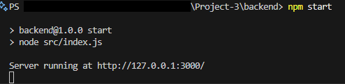

# Backend

This is the backend of the project for the LAN multiplayer WebSockets server.

## Startup Instructions

<!-- TODO: Once we fully implement the backend, update these instructions -->

To start the backend server, run the following commands from this directory (`backend`):

```bash
npm install
npm start
```

This is what you should see after running `npm start`:



NOTE: Leave this running in a separate terminal than the frontend.
