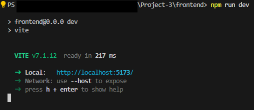

# Frontend

This is the frontend for the project, which is a React Vite web application.

## Startup Instructions

Run the following commands from this directory (`frontend`):

```bash
npm install
npm run dev
```

This is what you should see after running `npm run dev`:


